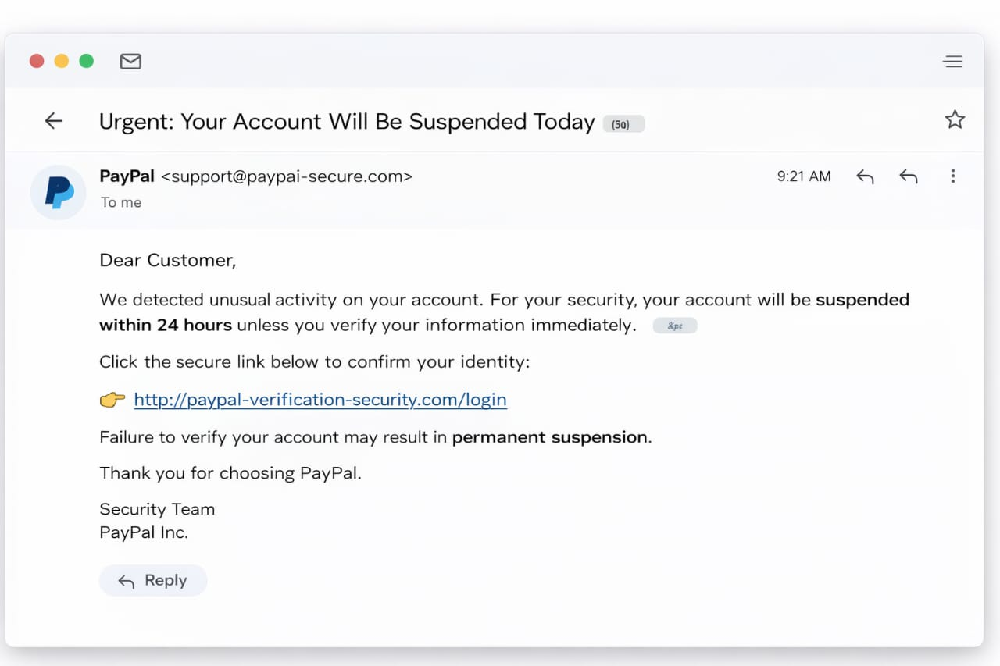
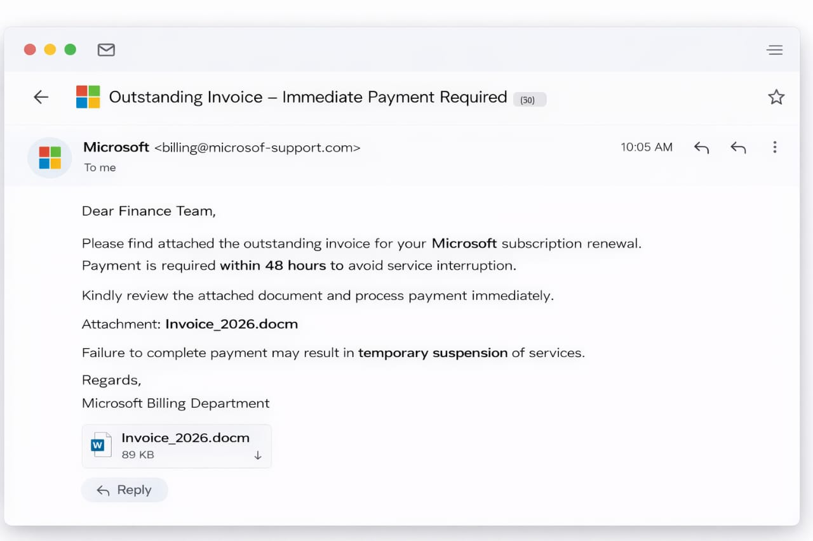

# Phishing Email Detection & Awareness System

## Table of Contents

1. [Introduction](#introduction)

2. [Account Suspension Phishing Email](#Account-Suspension-Phishing-Email)

3. [Invoice / Malware Phishing Email](#Invoice-and-Malware-Phishing-Email)

4. [Phishing Detection Checklist](#phishing-detection-checklist)

5. [Prevention & Awareness Guidelines](#prevention--awareness-guidelines)

6. [Conclusion](#conclusion)

7. [Report](#PDF-Version)

---

## Introduction
Phishing is a cyberattack technique that uses digital communication, such as emails or messages, to trick individuals into revealing sensitive information or installing malicious software.

It is dangerous because attackers can gain unauthorized access to Personally Identifiable Information (PII) and Sensitive Personally Identifiable Information (SPII). Phishing attacks can also deliver malware that disrupts business operations, cause financial losses, damage an organization’s reputation, and in severe cases, lead to operational shutdown.

This project demonstrates how phishing emails can be identified, analyzed, and explained in simple terms to improve user awareness and reduce organizational risk.

---

## Account Suspension Phishing Email

**Screenshot:**  

**Threat Analysis:**  

- **Spoofed Sender Address:** `support@paypaI-secure.com` (PayPal is misspelled; look-alike domain)

- **Urgency Tactic:** “Your account will be suspended within 24 hours”
 
- **Threat Language:** “Permanent suspension”

- **Suspicious Link:** `http://paypal-verification-security.com/login` (not official, uses HTTP)

- **Generic Greeting:** “Dear Customer”

**Classification:** Phishing (Credential Theft / Social Engineering)  

### Indicators of Compromise (IOCs):

- **Suspicious Sender Email:** `support@paypaI-secure.com`

- **Malicious Domain:** `paypal-verification-security.com`

- **Suspicious URL:** `http://paypal-verification-security.com/login`

- Urgency Phrase: “Suspended within 24 hours”

- Threat Phrase: “Permanent suspension”

---

## Invoice and Malware Phishing Email

**Screenshot:**  

**Threat Analysis:**  

- **Spoofed / Misspelled Domain:** `billing@microsof-support.com` (look-alike domain)
 
- **Suspicious Attachment:** `Invoice_2026.docm` (macro-enabled file, potential malware)

- **Urgency & Payment Pressure:** “Payment required within 48 hours”

- **Threat of Service Suspension:** “Temporary suspension of services”

- **Generic Greeting:** “Dear Finance Team”

**Classification:** Phishing (Malware Delivery + Business Email Compromise)  

## Indicators of Compromise (IOCs): 

- **Suspicious Sender Email:** `billing@microsof-support.com`

- **Malicious Attachment:** `Invoice_2026.docm`

- **Urgency Phrase:** “Payment required within 48 hours”

- **Threat Phrase:** “Temporary suspension of services”

- **Generic Greeting:** “Dear Finance Team”

---

## Phishing Detection Checklist

| **Check Item**       | **What to Look For**                     | **Why It Matters**                        |
|----------------------|-----------------------------------------|------------------------------------------|
| Sender Address        | Misspellings or unusual domains         | Indicates the email may be spoofed       |
| Greeting              | Generic terms like “Dear Customer”      | Legitimate companies personalize emails  |
| Urgency               | Short deadlines (24–48 hours)           | Creates panic and hasty actions          |
| Threat Language       | Suspension, termination, penalties      | Uses fear to manipulate the user         |
| Links                 | Hover over URLs to inspect the real link| Detect fake or malicious domains         |
| Attachments           | .docm, .exe, .zip files                 | May contain malware or malicious scripts |

---

## Prevention & Awareness Guidelines

1. **Use Strong, Unique Passwords** – Combine letters, numbers, symbols; avoid reuse.

2. **Enable Multi-Factor Authentication (MFA)** – Adds extra security even if passwords are stolen.

3. **Verify Before You Click** – Hover over links to check real destination; go to official sites directly.

4. **Keep Software and Systems Updated** – Fixes security vulnerabilities attackers exploit.

5. **Use Trusted Security Tools** – Antivirus, spam filters, and browser protections reduce phishing risks.

---

## Conclusion
Phishing awareness is essential because it educates individuals about the risks and consequences of social engineering attacks. Increased awareness reduces the likelihood of users falling victim to malicious emails.

User education plays a critical role in cybersecurity. When individuals understand what phishing is, how to recognize it, and how to prevent it, they contribute to a safer digital environment and significantly reduce an organization’s attack surface.

---

## PDF Version

A downloadable PDF version of this report is available here:
[Download the Full Report (PDF)](docs/Phishing_Email_Detection.pdf)
